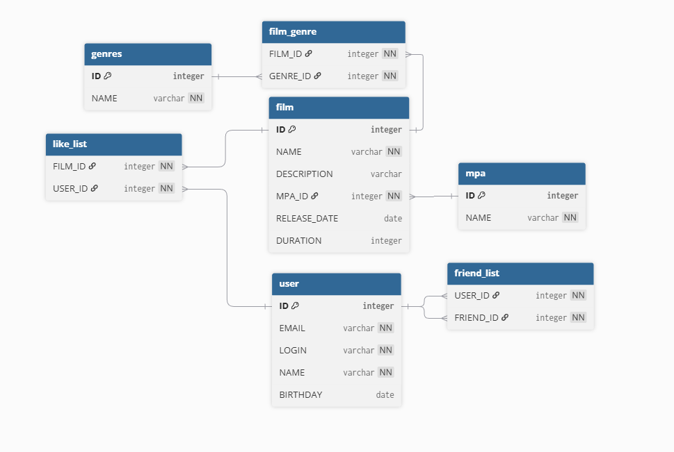

# java-filmorate

# Промежуточное задание в спринте №11.

### 1.Добавить пользователя

**INSERT INTO** "user" (EMAIL, LOGIN, NAME, BIRTHDAY)
**VALUES** ('vova@gmail.com', 'vova123', 'Vova', '1999-06-25');

### 2.Добавить лайк

**INSERT INTO** "like_list" (FILM_ID, USER_ID)  
**VALUES** (1, 1);

### 3.Получить жанры фильма

**SELECT** g.NAME  
**FROM** "film_genre" fg  
**JOIN** "genres" g ON fg.GENRE_ID = g.ID  
**WHERE** fg.FILM_ID = 1;